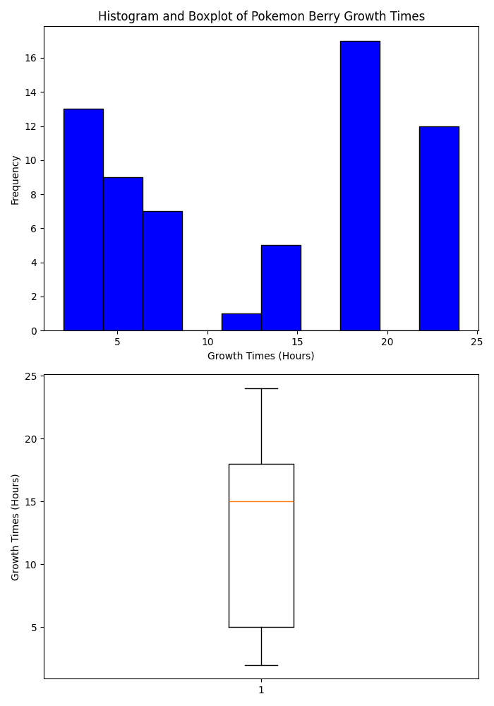

# Pokemon Berries Statistics Project

This project is a web application developed with FastAPI that allows users to retrieve and visualize statistics related to Pokemon berries. With that users could gain insights into the characteristics and distribution of growth times among different types of berries in the Pokemon universe. The application aims to facilitate analysis and understanding of berry-related data.

## Configuration


## Installation

1. Clone the project repository:

   ```bash
   git clone https://github.com/DanyRobRey/pokeberries_statistics.git

2. Navigate to the project directory:

    ```bash
    cd pokeberries_statistics

3. Make shure you are in main brach and pull changes:

    ```bash
    make checkout-pull

3. Install virtual environment:

    ```bash
    pip install virtualenv venv
    python3 -m venv venv

4. Activate virtual environment:

    ```bash
    .\venv\Scripts\activate
    source venv/bin/activate 

5. Install the necessary dependencies:

    ```bash 
    pip install -r requirements.txt


## Environment Variables

Use the same `.env-example` file to create get `.env` file.
No need to change nothing inside

## Local Execution

Using Uvicorn

- ```bash
  python main.py

- ```bash
  uvicorn main:app --reload

Using DOCKER (You must have docker installed)

1. Run make file start-build command line:
- ```bash
  make start-build

2. Run make file up command line:
- ```bash
  make up

3. Shut down Docker Image:
- ```bash
  make down
  
- The application will run on the specified port or on the default port 8000 if none is provided.


## Unit Test

Run make file test command line:
- ```bash
  make test -B

## Observations

- If you encounter permission issues while running the make commands, consider using sudo to execute them with administrative privileges.
- If the problem persists, please review the Makefile and try running the commands listed directly in the bash, pwsh, zsh console.

This should provide users with guidance on how to troubleshoot permission-related problems effectively.

## Swagger Automatic Documentation

For automatic documentation of the APIs and Pydantic schemas, you can use Swagger UI. Simply navigate to local host in your browser:

Swagger Documentation: http://0.0.0.0:8000/docs
This interactive documentation provides detailed information about each API endpoint, including request and response schemas, query parameters, and example requests. It's a convenient way to explore and understand the functionality of the application.

## Usage

This section outlines the usage of two APIs that retrieve information of Berries from PokeApi: You can use the included fastapi swagger tool or configure get methods using postman or insominia rest.


1. Get Poke Berries Statistics:
- ```bash
  GET /allBerryStats 

This endpoint retrieves statistics of berries from the Poke API. It provides insights into various aspects of berries such as their growth times, including minimum, median, maximum, variance, mean, and the most frequent growth time among the retrieved berries.

Parameters: None
Response: Returns a JSON object containing statistics about the berries.
Response Example:

- ```json
    {
        "berries_names": ["berry1", "berry2", ...],
        "min_growth_time": "2 hours",
        "median_growth_time": "4 hours",
        "max_growth_time": "8 hours",
        "variance_growth_time": "2.5 hours",
        "mean_growth_time": "5 hours",
        "frequency_growth_time": "4 hours"
    }

2. Get Poke Berries Plot:
- ```bash
- ```bash
  GET /allBerryStatsPlot

This endpoint generates a combined histogram and boxplot plot based on the statistics of Pokemon berries. It visualizes the distribution of growth times among the berries.

Parameters: None
Response: Returns the generated plot image in PNG format.
Response Example:



## Pokémon Api Berries Documentation

You can find the documentation page here about Pokémon API : https://pokeapi.co/docs/v2#berries

## Contact Information
If you have any questions, feedback, or suggestions regarding the project, feel free to reach me 
Email: cd.robayo10@outlook.com